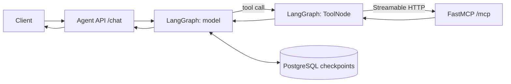

# LangGraph MCP Orchestrator

Dịch vụ AI agent dùng **LangGraph** để điều phối hội thoại và gọi tool từ dự án FastMCP HTTP ở thư mục `../MCP-Server`. API của agent là HTTP JSON tại `POST /chat`; MCP server tiếp tục cung cấp giao thức **Streamable HTTP** tại `/mcp`.

## Luồng xử lý



Graph được định nghĩa trong `src/agent_orchestrator/graph.py`. [MCPAdapter](https://docs.langchain.com/oss/python/langchain/mcp) khám phá tool qua URL của MCP server lúc agent khởi động. `ToolNode` thực thi tool được model chọn rồi chuyển kết quả lại cho model. Checkpointer PostgreSQL lưu lịch sử theo `thread_id` giữa các lượt gọi API. Nếu không đặt `DATABASE_URL`, agent dùng bộ nhớ tiến trình để phát triển cục bộ.

## Cấu trúc

```text
src/agent_orchestrator/
├── api.py        # FastAPI: /chat, /health, /ready
├── config.py     # Đọc và kiểm tra cấu hình môi trường
├── graph.py      # StateGraph: model <-> tools
├── runtime.py    # Vòng đời MCPAdapter, model, checkpointer
└── __main__.py   # Khởi chạy Uvicorn
tests/            # Test routing và HTTP API không cần API key thật
docs/             # Thiết kế và vận hành
compose.yaml      # Agent + MCP server + PostgreSQL
Dockerfile        # Image chạy bằng user không có quyền root
pyproject.toml    # Package và dependency
```

## Chạy đầy đủ bằng Docker Compose

Đặt dự án này cùng cấp với `MCP-Server`:

```text
Documents/
├── MCP-Server/
└── AI-Agent/
```

Trong thư mục `AI-Agent`:

```bash
cp .env.example .env
# Sửa OPENAI_API_KEY và POSTGRES_PASSWORD trong .env
docker compose up --build -d
docker compose ps
curl http://127.0.0.1:8080/ready
```

`POSTGRES_PASSWORD` nên chỉ gồm chữ và số trong ví dụ này vì Compose đưa nó vào PostgreSQL URL. Agent chỉ được công bố trên `127.0.0.1:8080`; MCP và PostgreSQL nằm trong mạng nội bộ Compose.

Gọi agent:

```bash
curl -X POST http://127.0.0.1:8080/chat \
  -H 'Content-Type: application/json' \
  -d '{"thread_id":"demo-1","message":"Hãy dùng tool MCP để chào An"}'
```

Gửi tiếp câu hỏi với cùng `thread_id` để agent dùng lịch sử hội thoại. Đổi `thread_id` cho một cuộc hội thoại độc lập. `GET /health` chỉ xác nhận HTTP process đang chạy; `GET /ready` xác nhận agent đã kết nối MCP và khởi tạo graph.

## Chạy mã nguồn trực tiếp

Yêu cầu Python 3.10+. Trước hết khởi chạy `../MCP-Server` tại `http://127.0.0.1:8000/mcp` theo README của dự án đó. Sau đó:

```bash
python3 -m venv .venv
source .venv/bin/activate
python -m pip install -e '.[dev]'
export OPENAI_API_KEY='your-key'
export OPENAI_MODEL='gpt-4.1-mini'
export MCP_URL='http://127.0.0.1:8000/mcp'
python -m agent_orchestrator
```

Không đặt `DATABASE_URL` ở chế độ này thì checkpoint chỉ tồn tại tới khi tiến trình dừng. Để lưu lâu dài, đặt `DATABASE_URL` tới PostgreSQL trước khi chạy. Biến `AGENT_HOST` (mặc định `127.0.0.1`) và `AGENT_PORT` (mặc định `8080`) điều khiển HTTP listener. File `.env` không tự được nạp khi chạy Python trực tiếp; hãy export biến hoặc dùng trình quản lý secret của bạn.

## Kiểm thử

```bash
python -m pytest -q
```

Test dùng model giả và tool cục bộ để kiểm tra cạnh model → tool → model, không gọi OpenAI hay MCP thật. CI chạy cùng lệnh khi push hoặc mở PR. Thử tích hợp thật bằng lệnh `curl` ở trên sau khi hai dịch vụ khởi động.

## Mở rộng

- Thêm tool vào `MCP-Server`; agent tự khám phá danh sách tool khi khởi động lại.
- Sửa `SYSTEM_PROMPT` trong `graph.py` để thay đổi cách điều phối. Khi có nhiều nhóm nghiệp vụ, thêm node và cạnh vào `StateGraph`.
- Nếu cần dùng **resource** hoặc **prompt** của MCP server, thêm bước đọc chúng qua FastMCP client; `MCPAdapter.list_tools()` chỉ nạp tool.
- Mỗi `thread_id` cần do ứng dụng gọi API quản lý ổn định. Không cho nhiều yêu cầu đồng thời cùng một `thread_id` nếu chưa thêm cơ chế đồng bộ theo hội thoại.

## Triển khai

Compose là cấu hình khởi đầu trên một máy. Trước khi công bố API ra Internet, đặt sau TLS và gateway có xác thực, cấu hình secret manager, giám sát/log, backup PostgreSQL, giới hạn số lần gọi và timeout. Pin toàn bộ dependency gián tiếp bằng lock file của trình quản lý gói bạn chọn trước khi phát hành image. Xem [docs/operations.md](docs/operations.md) để biết các điểm cần cấu hình.

`langchain.mcp.MCPAdapter` hiện được tài liệu LangChain đánh dấu **beta**; các phiên bản trực tiếp đã được pin trong `pyproject.toml` và cần kiểm thử khi nâng cấp.

Tài liệu gốc: [LangGraph Graph API](https://docs.langchain.com/oss/python/langgraph/quickstart), [LangChain MCP](https://docs.langchain.com/oss/python/langchain/mcp), [LangGraph memory](https://docs.langchain.com/oss/python/langgraph/add-memory).
